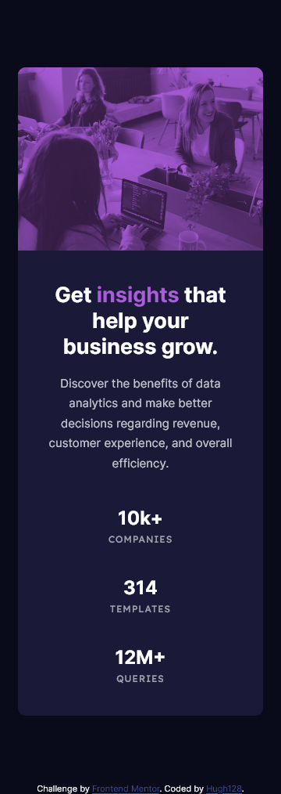

# Frontend Mentor - Stats preview card component solution

This is a solution to the [Stats preview card component challenge on Frontend Mentor](https://www.frontendmentor.io/challenges/stats-preview-card-component-8JqbgoU62). Frontend Mentor challenges help you improve your coding skills by building realistic projects. 

## Table of contents

- [Overview](#overview)
  - [The challenge](#the-challenge)
  - [Screenshot](#screenshot)
  - [Links](#links)
- [My process](#my-process)
  - [Built with](#built-with)
  - [What I learned](#what-i-learned)
  - [Continued development](#continued-development)
  - [Useful resources](#useful-resources)
- [Author](#author)
- [Acknowledgments](#acknowledgments)

## Overview
The code creates a stat preview card component made with HTML and CSS. I used CSS Flexbox to design the card.

### The challenge

Users should be able to:

- View the optimal layout depending on their device's screen size

### Screenshot

### Links

- Solution URL: (https://github.com/hugh128/stats_preview_card_component)
- Live Site URL: (https://hugh128.github.io/stats_preview_card_component/)

## My process
The first step in creating the statistics card was to create two containers; I used the first container to center the card on the screen and indicate the size that the card would occupy on the screen; I used the second container to indicate the position of the elements of the card; I divided the card into two blocks, the first block (the left block in the desktop view and the bottom block in the mobile view) contains the text of the card and the second block contains the image of the card.

To position the different elements of the card use CSS Flexbox.

### Built with

- Semantic HTML5 markup
- CSS
- Flexbox

### What I learned

I learned several things with this challenge:
1. Be able to position several elements in a given space.
2. Create a container to display the card in the center of the screen.
3. Change the color to an image.
4. Use Flexbox on various elements to create the desired design.

### Continued development

I am going to continue learning techniques to use CSS Flexbox and learn how to complement it with CSS Grid.

One useful technique I learned was to use containers for various items; that way it is easier to position the elements as blocks and place them in the desired position.

Also I am not very clear how to change the color of the image, I saw a video of how they did it so I am also going to delve into this topic.

### Useful resources

- (https://www.freecodecamp.org/learn/responsive-web-design/#responsive-web-design-principles) - This is an amazing resource that helped me apply CSS Flexbox. I would recommend it to anyone still learning this concept.

## Author

- Github - [Hugh](https://github.com/hugh128)
- Frontend Mentor - [@hugh128](https://www.frontendmentor.io/profile/hugh128)

## Acknowledgments

This is the video (https://www.youtube.com/watch?v=zaHdmJf_ld4) that I saw to be able to change the color of the image. A thank you.
